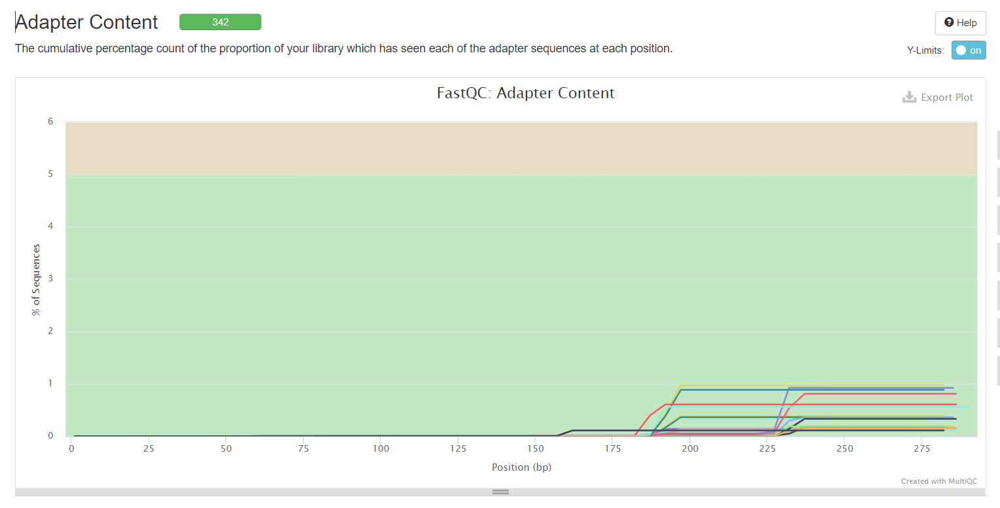

## 下载数据

数据来源：[PRJNA633959](https://www.ncbi.nlm.nih.gov/bioproject/PRJNA633959)

文章：[Structural and Functional Dysbiosis of Fecal Microbiota in Chinese Patients With Alzheimer' s Disease - PubMed (nih.gov)](https://pubmed.ncbi.nlm.nih.gov/33614635/)

该数据在 GMrepo 已有简单分析：[PRJNA633959 ](https://gmrepo.humangut.info/data/project/PRJNA633959)

SRAtoolkit 命令下载数据

```bash
prefetch --option-file PRJNA633959.txt --output-directory PRJNA633959/01_rawdata
```

解压

```bash
ls ./ | xargs -i fastq-dump --split-e ./{}/{}.sra
```

## 质检

一开始先进行质检，对数据有一个整体了解

使用 multiqc 和 fastqc 质检

```bash
mkdir 01_dataqc #创建一个文件夹用于存放质检文件，01_rawdatafq存放fastq文件
fastqc $PWD/00_rawdatafq/*fastq -t 10 -o $PWD/01_dataqc
#pip install multiqc #安装multiqc
multiqc 01_dataqc/*  
#合并报告，将生成的multiqc_report.html下载至本地浏览器查看aaaaaaaaaaaaaaaaaaaaaawwwwwwwwwwwwwwwww
```

### 确定有无引物

头部歪歪扭扭，说明有引物


Adapter Content 都是 0 就说明已经去除引物。这里明显是有引物

从图中说明并没有去除引物



整体的质检结果


查看文献知道数据测的是 V3-V4 区

### 如何知道自己的序列需不需要 demultiplex？

The files are demultiplexed.

In order to understand Demultiplexing, frst you have to understand multiplexing.

When you perform NGS on a bunch of samples, unlike conventional methods, you combine all your samples into one and load it into the sequencer. The mixing up of samples (libraries) is "Multiplexing".

Now you may wonder how you will differentiate the samples after sequencing.

I assume you carried your NGS on the Illumina platform, so I will explain the process based on Illumina chemistry.

When you prepare libraries for NGS, you add two oligonucleotides to your DNA fragments - Adapters and index.

Adapters are oligonucleotides that enables your DNA fragment to attach to the flowcell.

Indexes (sometimes refers as barcodes) helps to differentiate your samples after sequencing.

For eg: Imagine you have 10 different samples, during library preparation you will add 10 different indexes to your 10 samples. Before loading on to sequencer you will combine (Pool) all the libraries together.

During sequencing, the index sequences are also sequenced.

After sequencing, the fastq file will contain all the sequences from your 10 libraries.

Now you have to "De-multiplex" the single fastq file to obtain the sequences from 10 different samples.

With a computational tool, you can sort all the sequences with the same index to a group and according to the index used you can assign the sequences to your sample.

So if you have separated sequences for all your samples, your sequences are demultiplexed.

Multiplexing is a wet lab process while demultiplexing is a computational process

Illumina provides indexes along with library prep kits, and some kits enable you to combine up to 96 samples for a single sequencing run.

I hope you got a clear idea now.


## 导入数据

激活 qiime2 环境

```bash
conda activate qiime2-2021.2
```

通过脚本生成 `manifest.txt` 文件

```bash
echo 'sample-id','forward-absolute-filepath','reverse-absolute-filepath' > manifest.txt
ls *_R1.fastq |while read id; 
do 
echo "${id%%_*},$PWD/$id,$PWD/${id%%_*}_R2.fastq">> manifest.txt; 
done
```

> 原来还可以这样！直接对变量进行正则匹配截取左边或者右边一部分
>
> ```shell
> ~ $ id=AD_16s_R1.fastq
> ~ $ echo $id
> AD_R1.fastq
> ~ $ echo ${id%_*} # 从右边开始删到第一个匹配的
> AD_16s
> ~ $ echo ${id%%_*} # 从右侧开始删到最后一个匹配的
> AD
> ~ $ echo ${id#*_}  # 从左侧开始删除第一个匹配的就停止                                                                                                                 
> 16s_R1.fastq
> ~ $ echo ${id##*_}  # 从左侧开始删除最后一个匹配的
> R1.fastq
> ```
>

> 或者用 R
>
> ```r
> library(tibble)
> PWD <- "/mnt/raid7/Dachuang/Achuan/course_design/01_rawdata"
>
> PWD1 <- "/mnt/raid7/Dachuang/Achuan/course_design/"
>
> title <- c("sample-id", "forward-absolute-filepath", "reverse-absolute-filepath")
>
> sampleid <- read.table("id_sample.tsv")
>
> forward <- paste(PWD, "/", sampleid$V1, "_R1.fastq", sep = "")
>
> reverse <- paste(PWD, "/", sampleid$V1, "_R2.fastq", sep = "")
>
> manifest <- cbind(sampleid, forward, reverse)
>
> colnames(manifest) <- title
>
> write.table(manifest, file =  "manifest.txt", row.names = FALSE, quote = F, sep = "\t")
> ```
>

把测序数据导入 qiime2 中

```plaintext
qiime tools import \
    --type 'SampleData[PairedEndSequencesWithQuality]' \
    --input-path manifest.txt \
    --input-format PairedEndFastqManifestPhred33V2 \
    --output-path 01_paired-end-demux.qza
```


去除引物

引物文件：  
341F (5′-CCTACGGGNGGCWGCAG-3′)/805R (5′GACTACHVGGGTATCTAATCC-3′)

```bash
>forward_primer
CCTACGGGNGGCWGCAG
>reverse_primer
GACTACHVGGGTATCTAATCC
```

查看引物序列

```bash
grep CCTACGGG[AGCT]GGC[AT]GCAG
grep GACTAC[^G][^T]GGGTATCTAATCC
```

> [grep 查找引物序列 - 简书 (jianshu.com)](https://www.jianshu.com/p/ea0f27788287)
>

```bash
time qiime cutadapt trim-paired \
    --i-demultiplexed-sequences 01_paired-end-demux.qza \
    --p-front-f CCTACGGGNGGCWGCAG \
    --p-front-r GACTACHVGGGTATCTAATCC\
    --o-trimmed-sequences 01_paired-end-remove-primer.qza \
    --verbose \
    &> primer_trimming.log
```

结果

> Total read pairs processed:             38,658  
>   Read 1 with adapter:                  37,514 (97.0%)  
>   Read 2 with adapter:                  37,056 (95.9%)  
> Pairs that were too short:                   0 (0.0%)  
> Pairs written (passing filters):        38,658 (100.0%)
>
> Total basepairs processed:    23,040,168 bp  
>   Read 1:    11,481,426 bp  
>   Read 2:    11,558,742 bp  
> Total written (filtered):     21,631,630 bp (93.9%)  
>   Read 1:    10,848,126 bp  
>   Read 2:    10,783,504 bp
>
> 
>

## 质量检测

> DADA2 和 deblur 都执行质量过滤、去噪和嵌合体去除，因此在运行它们之前**不应该执行任何质量筛选**.
>
> 为保证数据质量和避免错误结果，16s rDNA 扩增子测序数据需要质控及预处理后，再用于下游的分析。首先常用 FastQC 软件对测序数据进行质量评估，由于一般公司的测序报告文件会附带评估报告，质量太差会重测，此步非本实验必须步聚。然后，利用常用的 NGS 质控工具(如 Trimmomatic)进行预处理，如过滤低质量 reads(Q < 20)，切除 read 末端低质量碱基与未识别碱基 N、切除测序接头(Adapters)、去除长度太短的序列等
>

可视化:将 qza 文件转化为 qzv 格式，上传至本地电脑，官网查看原序列质量报告

```bash
qiime demux summarize  \
    --i-data 01_paired-end-remove-primer.qza \
    --o-visualization 01_clean_data.qzv
# qzv文件用qiime2官网查看
https://view.qiime2.org/
# 2.或者命令
qiime tools view 02_demux.qzv
```


F 端的数据还好，R 端就明显不行了


## 降噪（Denoise）dada2

 denoising/merging/filtering

DADA2 数据处理不以序列相似度聚类，只进行去重（或相当于以 100% 序列相似度聚类），生成的是以 ASV 为单元的表格；

Vsearch 数据处理与 Usearch 类似，以序列间相似度聚类（默认序列相似度为 97%），生成的是 OTU 为单元的矩阵文件。

DADA2 去噪分析分辨率更高，准确性更强

降噪方法滤除有噪声的序列，校正边缘序列中的错误、去除嵌合序列、去除偶然序列（singletons，即：出现频率仅有一次的序列）、合并去噪后的双端序列，然后对这些序列进行去冗余。

```bash
qiime dada2 denoise-paired  \
    --i-demultiplexed-seqs 01_paired-end-remove-primer.qza  \
    --p-trim-left-f 0  \
    --p-trim-left-r 0  \
    --p-trunc-len-f 270  \
    --p-trunc-len-r 223  \
    --o-table 02_dada2/table.qza  \
    --o-representative-sequences 02_dada2/rep-seqs.qza  \
    --o-denoising-stats 02_dada2/denoising-stats.qza  \
    --p-n-threads 0   

```

> **参数：**
>
> --p-trim-left-f 0 ：表示从 forward 左端的第 0 位置开始  
> --p-trim-left-r 0： 表示从 reverse 左端的第 0 位置开始  
> --p-trunc-len-f 250 ：表示 forward 总共保留的长度为 250  
> --p-trunc-len-r 250：表示 reverse 总共保留的长度为 250  
> --p-n-threads 0  调用所有 CPU
>
> **输出**：  
>
> * 03_denoising-stats.qza: 过程统计
> * 03_table.qza: 特征表
> * 03_rep-seqs.qza: 代表序列
>
> 这步**花的时间最长**，可使用--p-n-threads 0 参数调用所有 CPU，减少运算时间。
>
>  **注意**：需要 20bp 以上的 overlap 才能使用 dada2 拼接，否则会报错。
>

> 试图使用 figaro[^1] 来直接判断正反向截断位点信息然而失败了
>

可视化结果,就是把 qza 文件转化为 qzv 文件

```bash
qiime metadata tabulate --m-input-file 02_dada2/denoising-stats.qza --o-visualization 02_dada2/denoising-stats.qzv

qiime feature-table summarize --i-table 02_dada2/table.qza --o-visualization 02_dada2/table.qzv

qiime feature-table tabulate-seqs --i-data 02_dada2/rep-seqs.qza \--o-visualization 02_dada2/repre-seqs.qzv
```

特征序列可按 kingdom 界、phylum 门、class 纲、order 目、family 科、genus 属、species 种等层次进行分类，提供了微生物区系的降维视角。

table.qzv


repre-seqs.qzv：序列是可以点击的，提供链接以针对 NCBI nt 数据库 BLAST 每个序列。


## 物种注释

物种组成分析：有 v4 测序区域用的是 ~~silva~~greengene 的 16S 数据构建的分类器 515F/806R，无 v4 测序区域建议使用全长参考数据库。

> 这个分类器是从 Greengenes 13_8 99%OTUs 上训练出来的，其中序列被修减至仅包含来自于 16S 区域的 250 个碱基，该 16S 区域在该分析中采用 V4 区域的 515F/806R 引物扩增并定序。 我们将把这个分类器应用于我们的序列数据中，这样即可生成从序列对应到物种的可视化图形
>

使用的 classifier 要和下载的 qiime2 版本一致，不然会有问题

greengene 的注释水平极差,建议使用 silva 数据库作为物种注释的首选参考数据库。

```bash
#v4 wget https://data.qiime2.org/2021.2/common/silva-138-99-nb-classifier.qza
qiime feature-classifier classify-sklearn \
    --i-classifier ./db/silva-138-99-nb-classifier.qza \
    --i-reads 02_dada2/rep-seqs.qza \
    --o-classification 02_dada2/taxonomy.qza
```

```bash
 time qiime metadata tabulate \
--m-input-file 02_dada2/taxonomy.qza \
--o-visualization 02_dada2/taxonomy.qzv

```

> silva 注释门水平 喜欢用 ota 而不是 ria。至少三种原核生物分类学命名法被广泛使用。Greengenes 命名法基于 NCBI Taxonomy 数据库，RDP 使用 Bergey's Manual，而 LPT 和 SILVA 基于 Bergey's Manual 和 LSPN。[LPSN - List of Prokaryotic names with Standing in Nomenclature (dsmz.de)](https://lpsn.dsmz.de/)
>

### Blastn 检验

前面提到 repre-seqs.qzv 的显示的碱基序列是可以点击的，可以随意点击几个检验下

* ffc36e27c82042664a16bcd4d380b286 
  * blastn： Escherichia coli
  * 注释 d__Bacteria; p__Proteobacteria; c__Gammaproteobacteria; o__Enterobacterales; f__Enterobacteriaceae; g__Escherichia-Shigella
* 0005d7ea1cd3c0901ee82fe531246b52
  * blastn：Cronobacter sakazakii strain
  * 注释：d__Bacteria; p__Firmicutes; c__Clostridia; o__Oscillospirales; f__Oscillospiraceae; g__UCG-002
* 002f86050f1ebc047c12adfe041e0611：  
  blastn
  * blastn：uncultured Bacteroides sp.
  * 注释：d__Bacteria; p__Bacteroidota; c__Bacteroidia; o__Bacteroidales; f__Bacteroidaceae; g__Bacteroides; s__Bacteroides_plebeius

## 过滤 features

[Qiime2(四) -过滤 feature table - 简书 (jianshu.com)](https://www.jianshu.com/p/e9db848841f2)

根据 table 的结果设置过滤 threshold，阈值有 frequency 和 samples，即 ASV 在所有样本的总 reads 和出现在样本数目。

❓ 计算平均采样深度（对所有 ASV 的 count 加和并求平均值），设置采样阈值（如千分之一）后再乘以平均采样深度即获得 frequency 阈值，另外也可以设置 ASV 出现在多少样本内。

```bash
printf '####filter feature otu####\n'

#  过滤掉罕见的 ASVs
# 要计算这个 cut-off 值，你需要查看DATA2生成的报告table.qzv报告，确定平均样本深度22,871，乘以0.001
#过滤掉低频率（所有样本的总 reads低于22）与低观察（仅在少于2个样本中出现）的features
qiime feature-table filter-features \
 --i-table 02_dada2/table.qza \
 --p-min-frequency 22 \
 --p-min-samples 2 \
 --o-filtered-table 03_filtered/table_filt_fre.qza

# 过滤污染物及未分类的 ASVs
## 过滤线粒体和叶绿体（不区分大小写），以及至少注释到门的ASV
qiime taxa filter-table \
   --i-table 03_filtered/table_filt_fre.qza \
   --p-include p__ \
   --i-taxonomy 02_dada2/taxonomy.qza \
   --p-exclude mitochondria,chloroplast \
   --o-filtered-table 03_filtered/table_filt_contam.qza
## feature 4940 -> 1,584
# 排除低深度的样本
qiime feature-table summarize \
   --i-table 03_filtered/table_filt_contam.qza \
   --o-visualization 03_filtered/table_filt_contam.qzv
## 从这个表中，我们可以确定样品的最大深度。然后用这个值设置 --p-max-depth 参数，绘制稀疏曲线：最大频率为39,138

```

### 查看 observe 指数

稀疏曲线 基于 observe feature 说明样品的深度都足够，不需要过滤样本

```bash
qiime diversity alpha-rarefaction \
   --i-table 03_filtered/table_filt_contam.qza \
   --p-max-depth 39138 \
   --p-steps 20 \
   --p-metrics 'observed_features' \
   --o-visualization 03_filtered/rarefaction_curves_test.qzv
```


因为每个样本的测序深度都足够，不需要过滤样本，     于是直接把 table_filt_contam.qza 当成最终过滤的成品

> 稀疏曲线还有一个作用是看不同样本的 α 多样性
>

```bash
cp 03_filtered/table_filt_contam.qza 03_filtered/table_final.qza
```

### 取子集和汇总过滤后的结果

一旦我们有了最终筛选后的特征数据，我们将需要过滤后的 ASV 对应的序列。

```bash
qiime feature-table filter-seqs \
   --i-data 02_dada2/rep-seqs.qza \
   --i-table 03_filtered/table_final.qza \
   --o-filtered-data 03_filtered/rep_seqs_final.qza
```

再对筛选的序列进行物种注释？（因为不知道怎么筛选物种

```bash
qiime feature-classifier classify-sklearn \
    --i-classifier db/silva-138-99-nb-classifier.qza \
    --i-reads 03_filtered/rep_seqs_final.qza \
    --o-classification 03_filtered/taxonomy_final.qza

```

可视化最终的 table 、tax、seq 表

```bash
qiime feature-table summarize \
--i-table 03_filtered/table_final.qza \
--o-visualization 03_filtered/table_final_summary.qzv


qiime feature-table tabulate-seqs \
    --i-data  03_filtered/rep_seqs_final.qza \
    --o-visualization  03_filtered/rep_seqs_final_summary.qzv

# 这个得到的只是ASV对应物种的表
qiime metadata tabulate \
--m-input-file 03_filtered/taxonomy_final.qza \
--o-visualization 03_filtered/taxonomy_summary.qzv
```

## 生成相对丰度堆叠柱状图

绘制每个样本的条形图

```bash
mkdir -p 04_analysis/AbundanceAnalysis/
qiime taxa barplot --i-table 03_filtered/table_final.qza \
   --i-taxonomy 03_filtered/taxonomy_final.qza \
   --m-metadata-file ./metadata.txt \
   --o-visualization 04_analysis/AbundanceAnalysis/taxonomy_bar_plots.qzv
    
```

里面的 csv 文件其实非常有用，而且已经默认帮你在各层级折叠了


根据 metadata 中的分类信息分组绘制堆叠柱状图：

```bash

qiime feature-table group \
   --i-table 03_filtered/table_final.qza \
   --p-axis sample \
   --p-mode sum \
   --m-metadata-file ./metadata.txt \
   --m-metadata-column Group \
   --o-grouped-table 03_filtered/table_final_CATEGORY.qza

qiime taxa barplot \
   --i-table 03_filtered/table_final_CATEGORY.qza \
   --i-taxonomy 03_filtered/taxonomy_final.qza \
   --m-metadata-file ./metadata_group.txt \
   --o-visualization 04_analysis/AbundanceAnalysis/taxa_barplot_CATEGORY.qzv
```

## 导出 tsv 表

```bash


mkdir 03_filtered/output/
# 导出序列
qiime tools export \
--input-path 03_filtered/rep_seqs_final.qza \
--output-path 03_filtered/output/
# 导出ASV表
qiime tools export \
--input-path 03_filtered/table_final.qza \
--output-path 03_filtered/output/

biom convert \
-i 03_filtered/output/feature-table.biom \
-o 03_filtered/output/otu_table.tsv \
--to-tsv
sed -i '1d' 03_filtered/output/otu_table.tsv

# 导出taxnomoy
qiime tools export \
--input-path 03_filtered/taxonomy_final.qza \
--output-path 03_filtered/output

sed -i -e '1 s/Feature/#Feature/' -e '1 s/Taxon/taxonomy/' 03_filtered/output/taxonomy.tsv

# 合并ASV和Taxonomy
biom add-metadata \
   -i 03_filtered/output/feature-table.biom \
   -o 03_filtered/output/feature-table_w_tax.biom \
   --observation-metadata-fp 03_filtered/output/taxonomy.tsv \
   --sc-separated taxonomy

biom convert \
   -i 03_filtered/output/feature-table_w_tax.biom \
   -o 03_filtered/output/feature-table_w_tax.txt \
   --to-tsv \
   --header-key taxonomy

sed -i '1d' 03_filtered/output/feature-table_w_tax.txt


```

得到的是 ASV 和 tax 合并的表格，tax 是最后一列


## 使用 mafft 建树

进行多样性分析会使用到一些基于**系统发育的多样性指数**，包括 `Faith’s Phylogenetic Diversity`、`weighted` 和 `unweighted UniFrac`。这些指数需要使用到由 ASV 序列文件构建的有根的进化树。这里使用的是 `qiime phylogeny` 命令的 `align-to-tree-mafft-fasttree` 流程。

从命令的命名也可以看出，该流程是首先调用 `mafft` 程序执行对 ASV 特征序列中的每条 ASV 序列进行多序列比对并对齐，创建 QIIME 2 对象 aligned-rep-seqs.qza (对齐的序列文件)。接下来，流程会对对齐的高度可变区 (高变区, 或者无意义的噪声区域) 进行 mask 或过滤。随后，调用 `FastTree` 程序基于 mask 后的对齐的序列文件生成系统发育树，该程序创建的是一个无根树，因此流程最后会使用 “根中点法” 将树的根放置在无根树中最长端到端距离的中点，从而形成有根树

```bash
mkdir 03_filtered/tree/
qiime phylogeny align-to-tree-mafft-fasttree \
--i-sequences 03_filtered/rep_seqs_final.qza \
--o-alignment 03_filtered/tree/aligned-rep-seqs.qza \
--o-masked-alignment 03_filtered/tree/masked-aligned-rep-seqs.qza \
--o-tree 03_filtered/tree/unrooted-tree.qza \
--o-rooted-tree 03_filtered/tree/rooted-tree.qza

qiime tools export \
    --input-path 03_filtered/tree/rooted-tree.qza \
    --output-path 03_filtered/tree/exported-tree 
```

## alpha 稀疏曲线（Alpha rarefaction curve）

> A key quality control step is to plot rarefaction curves for all of your samples to determine if you performed sufficient sequencing. The below command will generate these plots (X is a placeholder for the maximum depth in your dataset, which you can determine by running the summarize command above). Depending on if you decided to exclude any samples you may not want to re-create rarefaction curves. Note however that the below command will output rarefaction curves for a range of alpha-diversity metrics (including phylogenetic metrics), whereas above the curves were based on richness (referred to as `observed_features`) only. Also note that the `$METADATA` bash variable was defined at the first step of this SOP and simply points to the metadata table.
>

目的：查看测序量是否足够

按分组合并来展示稀疏曲线

```bash
mkdir -p 04_analysis/AlphaDiversity/
qiime diversity alpha-rarefaction \
   --i-table 03_filtered/table_final.qza \
   --p-max-depth 39138 \
   --p-steps 20 \
   --i-phylogeny 03_filtered/tree/rooted-tree.qza \
   --m-metadata-file ./metadata.txt \
   --o-visualization 04_analysis/AlphaDiversity/rarefaction_curves.qzv
```

按每个样本来展示稀疏曲线

```bash
qiime diversity alpha-rarefaction \
   --i-table 03_filtered/table_final.qza \
   --p-max-depth 39138 \
   --p-steps 20 \
   --i-phylogeny 03_filtered/tree/rooted-tree.qza \
   --o-visualization 04_analysis/AlphaDiversity/rarefaction_curves_sample.qzv
```

> 如果稀疏曲线延 x 轴趋于平缓，则代表观察到了样品的丰富程度，收集超出该采样深度的其它序列不太可能得到新的多样性。上方图中的方框图代表了每组样本在每一个均匀采样深度上所选择的 alpha 多样性度量的分布。其下方图的折线图显示了每组样本的数量(即：为每个盒状图的样本量)。
>

## α 和 β 分析

### 计算多样性指数

[[转载]物种 Alpha 多样性指数简介及 R 语言实现 | 梅卫平の阅览室 (meiweiping.cn)](http://meiweiping.cn/%E8%BD%AC%E8%BD%BD-%E7%89%A9%E7%A7%8DAlpha%E5%A4%9A%E6%A0%B7%E6%80%A7%E6%8C%87%E6%95%B0%E7%AE%80%E4%BB%8B/)

QIIME 2 数据分析流程通过 qiime diversity 接口提供了分析 Alpha 多样性的各种命令，使用以下命令可以针对性地生成所选的多样性指数文件：

--p-metric : 选择一种方式：enspie|michaelis_menten_fit | strong | lladser_pe | fisher_alpha| goods_coverage | doubles | simpson | margalef | observed_otus | osd  
| shannon | pielou_e | chao1 | brillouin_d | menhinick | simpson_e  
| kempton_taylor_q | robbins | dominance | lladser_ci|heip_e  
| singles | chao1_ci | mcintosh_d | ace | mcintosh_e | gini_index  
| berger_parker_d | esty_ci


goods_coverage 指数公式如下。 **F1，群落中仅包含 1 个个体的物种数；N，群落物种总数** 。


goods_coverage 指数的  **取值范围 0~1，单位是一个概率** 。

goods_coverage 常用在微生物 16S/18S/ITS 测序中，作为反映测序深度的指标。 **其值越接近于 1，说明测序深度越合理，测序深度已经基本覆盖到样品中所有的物种；反之，测序深度不高，许多物种仅被测到了一次，暗示着很多低丰度物种可能尚未被测序测到** 。

```bash
qiime diversity alpha --i-table 03_filtered/table_final.qza --p-metric goods_coverage --o-alpha-diversity 04_analysis/AlphaDiversity/goods_coverage.qza

# 导出
qiime tools export \
  --input-path 04_analysis/AlphaDiversity/goods_coverage.qza \
  --output-path 04_analysis/AlphaDiversity
   
```

> 然后突然意识到对于 DADA2 流程来说，不能在它之后用 Good Coverage ，因为 singletons are filtered out by default. 值就一定为 1 了。所以看 rarefaction curve 就够了
>

### 计算核心多样性

在 QIIME 2 中，可以使用单个命令 core-metrics-phylogenetic 计算常见的 alpha 和 beta 多样性度量。此外，排序图（如加权 UniFrac 距离的 PCoA 图）也将自动生成

如下：

* α 多样性
  * 香农(Shannon’s)多样性指数（群落丰富度的定量度量，即包括丰富度 `richness` 和均匀度 `evenness` 两个层面）
  * Observed OTUs（群落丰富度的定性度量，只包括丰富度）
  * Faith’s 系统发育多样性（包含特征之间的系统发育关系的群落丰富度的定性度量）
  * 均匀度（或 Pielou’s 均匀度；群落均匀度的度量）
* β 多样性
  * Jaccard 距离（群落差异的定性度量，即只考虑种类，不考虑丰度）
  * Bray-Curtis 距离（群落差异的定量度量）
  * 非加权 UniFrac 距离（包含特征之间的系统发育关系的群落差异定性度量）
  * 加权 UniFrac 距离（包含特征之间的系统发育关系的群落差异定量度量）

> [QIIME 2 用户文档. 4 人体各部位微生物组分析实战 Moving Pictures(2018.11) - Community Contributions / Translations - QIIME 2 Forum](https://forum.qiime2.org/t/qiime-2-4-moving-pictures-2018-11/7598)
>

此命令还将在计算这些度量之前将所有样本稀疏到样本排序深度，即抽平（--p-sampling-depth X 是最低合理样本深度的占位符；深度低于此截止值的样本将被排除）。

需要提供给这个脚本的一个重要参数是 `--p-sampling-depth`，它是指定重采样（即稀疏/稀释）深度。因为大多数多样指数对不同样本的不同测序深度敏感，所以这个脚本将随机地将每个样本的测序量重新采样至该参数提供的值。例如，如果提供 `--p-sampling-depth 500`，则此步骤将对每个样本中的计数进行无放回抽样，从而使得结果表中的每个样本的总计数为 500。如果任何样本的总计数小于该值，那么这些样本将从多样性分析中删除。选择这个值很棘手。我们建议你通过查看上面创建的表 `table.qzv` 文件中呈现的信息并 **选择一个尽可能高的值（因此每个样本保留更多的序列）同时尽可能少地排除样本来进行选择** 。

```bash
qiime diversity core-metrics-phylogenetic \
   --i-table 03_filtered/table_final.qza \
   --i-phylogeny 03_filtered/tree/rooted-tree.qza \
   --p-sampling-depth 10971 \
   --m-metadata-file ./metadata.txt \
   --output-dir 04_analysis/Diversity
```

> 重抽样深度参数 `--p-sampling-depth` 呢？  
> 如是数据量都很大，选最小的即可。如果有个别数据量非常小，去除最小值再选最小值。比如此分析最小值为 917，我们选择 1109 深度重抽样，即保留了大部分样品用于分析，又去除了数据量过低的异常值。
>


### α 多样性

alpha 比较不同分组中物种多样性的差异（用箱线图展示，文章中经常用到）。一般情况下健康组中的微生物多样性会高于疾病组，原因可能是疾病组中一些致病菌丰度增加，对其它菌群产生了抑制作用。此外也有一些疾病类型出现疾病组微生物多样性高于健康组的情况，如阴道疾病。通常仅用 1 个指数来表征这种差异，如 chao 1 指数或 shannon 指数或 simpon 指数。p 值小于 0.05 说明组间 alpha 多样性存在显著性差异。

接下来我们可以比较不同组的 alpha 多样性并绘制箱线图。例如，生成箱线图比较 Shannon alpha 多样性：

```bash
qiime diversity alpha-group-significance \
   --i-alpha-diversity 04_analysis/Diversity/shannon_vector.qza \
   --m-metadata-file ./metadata.txt \
   --o-visualization 04_analysis/AlphaDiversity/shannon_compare_groups.qzv

qiime diversity alpha-group-significance \
  --i-alpha-diversity 04_analysis/Diversity/faith_pd_vector.qza \
  --m-metadata-file ./metadata.txt \
  --o-visualization 04_analysis/AlphaDiversity/faith-pd-group-significance.qzv

qiime diversity alpha-group-significance \
  --i-alpha-diversity 04_analysis/Diversity/evenness_vector.qza \
  --m-metadata-file ./metadata.txt\
  --o-visualization 04_analysis/AlphaDiversity/evenness-group-significance.qzv
```

### β 多样性

Beta 多样性分析通过物种距离比较两两样本在物种多样性方面的差异，其考虑了物种间的进化距离，指数越大表示样本间差异越大。分析结果通常分为加权（Weighted）和非加权（Unweighted）两种。加权 UniFrac 考虑序列的丰度，保留物种原度特征；非加权 UniFrac 不考虑序列的丰度，只考虑物种的有无，会扩大或缩小物种丰度的差异。

为了更直观展示样品间物种多样性差异，通常用到 PCoA（主坐标分析）或 NMDS（非度量多维尺度分析）分析。每个点代表一个样本，不同颜色代表不同分组。两个样品距离越近，表示二者物种组成越相似。不同处理或不同环境间的样品可能表现出分散和聚集的分布情况，从而可以判断相同条件的样品组成是否具有相似性。横纵坐标代表对分组差异贡献度最大的两个主坐标（无实际意义），p 值表示两组在相应主坐标上的差异程度，p 值 <0.05 表示有显著性。

结果发现区别的都好开

bray_curtis_emperor


/weighted_unifrac_emperor


unweighted_unifrac_emperor


jaccard_emperor


看 p 值?这个对于 β 多样性好像没什么用

```bash
qiime diversity beta-group-significance \
    --i-distance-matrix result/diversity/unweighted_unifrac_distance_matrix.qza \
    --m-metadata-file ./metadata.txt \
    --m-metadata-column Group \
    --o-visualization result/diversity/unweighted-unifrac-significance.qzv \
    --p-pairwise 

```

## 用 ANCOM 识别差异特征

ANCOM(Analysis of composition of microbiomes)是专门用于比较微生物组学数据中物种在组间的显著性差异的分析方法。ANCOM 分析不依赖于数据的分布假设，并解决了在其他方法中相对丰度分析所带来的限制，从而能够有效降低结果的假阳性。

> 论文：Mandal S., et al. Analysis of composition of microbiomes: a novel method for studying microbial composition. Microb. Ecol. Health. Dis., 29;26:27663 (2015).
>

> **其他差异分析方法**
>
> Kruskal Wallis/ANOVA/LEfSe/DESeq2 等分析也被用于物种各分类水平在组间的显著性差异
>
> Kruskal Wallis 和 ANOVA 提供检验统计量（Test-Statistic），总的 p 值（P），校正错误发现率 p 值（FDR_P），Bonferroni 校正 p 值（Bonferroni_P），及各分组均值，但不提供多重比较的结果；ANOVA 是参数检验，要求丰度服从正态分布，而**大部分物种的丰度都是不服从正态分布的**；Kruskal Wallis 属于非参数检验，对分布没有要求，**较为适合菌群分析**。
>
> LEfSe 方法基于相对丰度表，是非参数检验和线性判别分析的结合，适合菌群丰度差异检验；LEfSe 寻找每一个分组的特征微生物（LDA> 阈值的微生物
>
> 用 DESeq2 方法在分组间进行多重比较，寻找每两个分组之间显著差异的微生物。
>
> DESeq2 和 ANCOM 两种方法都是基于**比例**来进行差异分析的，相较于传统的相对丰度，比例的好处在于，**样本中某一个物种丰度发生变化，在统计上并不会影响另一个物种的丰度**，而相对丰度则不然。❓
>
> 推荐使用 LEfSe 先去查看某物种在多组之间的丰度差异，再使用 DESeq2 去了解具体的两两分组比较结果
>

> ANCOM 假设很少（小于约 25%）的特征在组之间改变。 **如果你期望在组之间有更多的特性正在改变，那么就不应该使用 ANCOM** ，因为它更容易出错（I 类/假阴性和 II 类/假阳性错误都有可能增加）。因为我们预期身体部位的许多特征都会发生变化，所以在本教程中，我们将过滤完整的特征表后只包含肠道样本。然后，我们将应用 ANCOM 来确定哪种（如果有的话）序列变体在我们两个受试者的肠道样本中丰度存在差异。
>

ANCOM 的分析基于绝对丰度表（所有值加 1），运用了 qiime2 composition ancom 命令。

> ANCOM 是一种测试样本集合之间特征的相对 f 丰度差异的方法。但它要求所有的特征为非零值，所以首先需要添加一个假计数（一般选择 1）
>

这个生成的是 ASV 的，我需要的是物种注释水平的

```bash
qiime composition add-pseudocount \
   --i-table 03_filtered/table_final.qza \
   --p-pseudocount 1 \
   --o-composition-table 03_filtered/table_final_pseudocount.qza

mkdir 04_analysis/ancom_output/
qiime composition ancom \
   --i-table 03_filtered/table_final_pseudocount.qza \
   --m-metadata-file ./metadata.txt \
   --m-metadata-column Group \
   --o-visualization 04_analysis/ancom_output/features_ancom.qzv

```

对六种 level 进行显著性分析

```bash
mkdir collapesed
# Kingdom, Phylum, Class, Order, Family, Genus, Species 
# l2门水平
qiime taxa collapse --i-table 06_filtered/table_final.qza --i-taxonomy 06_filtered/taxonomy_final.qza --p-level 2 --o-collapsed-table collapesed/table_phylum.qza 

qiime composition add-pseudocount \
   --i-table collapesed/table_phylum.qza  \
   --p-pseudocount 1 \
   --o-composition-table collapesed/table_phylum_pseudocount.qza

qiime composition ancom \
   --i-table collapesed/table_phylum_pseudocount.qza \
   --m-metadata-file ./metadata.txt \
   --m-metadata-column Group \
   --o-visualization result/ancom_output/l2_phylum_ancom.qzv

# l3 Class level
qiime taxa collapse --i-table 06_filtered/table_final.qza --i-taxonomy 06_filtered/taxonomy_final.qza --p-level 3 --o-collapsed-table collapesed/table_class.qza 

qiime composition add-pseudocount \
   --i-table collapesed/table_class.qza  \
   --p-pseudocount 1 \
   --o-composition-table collapesed/table_class_pseudocount.qza

qiime composition ancom \
   --i-table collapesed/table_class_pseudocount.qza \
   --m-metadata-file ./metadata.txt \
   --m-metadata-column Group \
   --o-visualization result/ancom_output/l3_class_ancom.qzv

# l4 Order level
qiime taxa collapse --i-table 06_filtered/table_final.qza --i-taxonomy 06_filtered/taxonomy_final.qza --p-level 4 --o-collapsed-table collapesed/table_order.qza 

qiime composition add-pseudocount \
   --i-table collapesed/table_order.qza  \
   --p-pseudocount 1 \
   --o-composition-table collapesed/table_order_pseudocount.qza

qiime composition ancom \
   --i-table collapesed/table_order_pseudocount.qza \
   --m-metadata-file ./metadata.txt \
   --m-metadata-column Group \
   --o-visualization result/ancom_output/l4_order_ancom.qzv

# l5 Family level
qiime taxa collapse --i-table 06_filtered/table_final.qza --i-taxonomy 06_filtered/taxonomy_final.qza --p-level 5 --o-collapsed-table collapesed/table_family.qza 

qiime composition add-pseudocount \
   --i-table collapesed/table_family.qza  \
   --p-pseudocount 1 \
   --o-composition-table collapesed/table_family_pseudocount.qza

qiime composition ancom \
   --i-table collapesed/table_family_pseudocount.qza \
   --m-metadata-file ./metadata.txt \
   --m-metadata-column Group \
   --o-visualization result/ancom_output/l5_family_ancom.qzv

# l6 Genus level
qiime taxa collapse --i-table 06_filtered/table_final.qza --i-taxonomy 06_filtered/taxonomy_final.qza --p-level 6 --o-collapsed-table collapesed/table_genus.qza 

qiime composition add-pseudocount \
   --i-table collapesed/table_genus.qza  \
   --p-pseudocount 1 \
   --o-composition-table collapesed/table_genus_pseudocount.qza

qiime composition ancom \
   --i-table collapesed/table_genus_pseudocount.qza \
   --m-metadata-file ./metadata.txt \
   --m-metadata-column Group \
   --o-visualization result/ancom_output/l6_genus_ancom.qzv

## l7 Species level
qiime taxa collapse --i-table 06_filtered/table_final.qza --i-taxonomy 06_filtered/taxonomy_final.qza --p-level 7 --o-collapsed-table collapesed/table_species.qza 

qiime composition add-pseudocount \
   --i-table collapesed/table_species.qza  \
   --p-pseudocount 1 \
   --o-composition-table collapesed/table_species_pseudocount.qza

qiime composition ancom \
   --i-table collapesed/table_species_pseudocount.qza \
   --m-metadata-file ./metadata.txt \
   --m-metadata-column Group \
   --o-visualization result/ancom_output/l7_species_ancom.qzv


```

| Phylum                         | W  |
| -------------------------------- | ---- |
| k__Bacteria;p__Verrucomicrobia | 11 |

| Class                                              | W  |
| ---------------------------------------------------- | ---- |
| k__Bacteria;p__Verrucomicrobia;c__Verrucomicrobiae | 19 |

| Order                                                                    | W  |
| -------------------------------------------------------------------------- | ---- |
| k__Bacteria;p__Verrucomicrobia;c__Verrucomicrobiae;o__Verrucomicrobiales | 33 |
| k__Bacteria;p__Firmicutes;c__Bacilli;o__Bacillales                       | 30 |
| k__Bacteria;p__Firmicutes;c__Clostridia;o__Clostridiales                 | 26 |
| k__Bacteria;p__Proteobacteria;c__Gammaproteobacteria;o__Pasteurellales   | 24 |

| Family                                                                                          | W  |
| ------------------------------------------------------------------------------------------------- | ---- |
| k__Bacteria;p__Verrucomicrobia;c__Verrucomicrobiae;o__Verrucomicrobiales;f__Verrucomicrobiaceae | 64 |

| Genus                                                                                                          | W   |
| ---------------------------------------------------------------------------------------------------------------- | ----- |
| k__Bacteria;p__Firmicutes;c__Clostridia;o__Clostridiales;f__Ruminococcaceae;g__Faecalibacterium                | 143 |
| k__Bacteria;p__Firmicutes;c__Clostridia;o__Clostridiales;f__Lachnospiraceae;g__Roseburia                       | 141 |
| k__Bacteria;p__Firmicutes;c__Erysipelotrichi;o__Erysipelotrichales;f__Erysipelotrichaceae;g__Clostridium       | 138 |
| k__Bacteria;p__Verrucomicrobia;c__Verrucomicrobiae;o__Verrucomicrobiales;f__Verrucomicrobiaceae;g__Akkermansia | 136 |
| k__Bacteria;p__Firmicutes;c__Clostridia;o__Clostridiales;f__Lachnospiraceae;g__Coprococcus                     | 132 |

| Species                                                                                                                       | W   |
| ------------------------------------------------------------------------------------------------------------------------------- | ----- |
| k__Bacteria;p__Firmicutes;c__Clostridia;o__Clostridiales;f__Ruminococcaceae;g__Faecalibacterium;s__                           | 201 |
| k__Bacteria;p__Firmicutes;c__Clostridia;o__Clostridiales;f__Lachnospiraceae;g__Roseburia;s__inulinivorans                     | 194 |
| k__Bacteria;p__Verrucomicrobia;c__Verrucomicrobiae;o__Verrucomicrobiales;f__Verrucomicrobiaceae;g__Akkermansia;s__muciniphila | 192 |
| k__Bacteria;p__Actinobacteria;c__Actinobacteria;o__Bifidobacteriales;f__Bifidobacteriaceae;g__Bifidobacterium;s__breve        | 191 |
| k__Bacteria;p__Firmicutes;c__Clostridia;o__Clostridiales;f__Lachnospiraceae;g__Clostridium;s__fimetarium                      | 189 |
| k__Bacteria;p__Firmicutes;c__Erysipelotrichi;o__Erysipelotrichales;f__Erysipelotrichaceae;g__Clostridium;__                   | 182 |
| k__Bacteria;p__Firmicutes;c__Clostridia;o__Clostridiales;f__Lachnospiraceae;g__Coprococcus;s__eutactus                        | 182 |

## Lefse 分析

LDA Effect Size（LEfSe）分析，采用线性判别分析（LDA）来估算每个组分（物种）丰度对差异效果影响的大小，找出对样本划分产生显著性差异影响的群落或物种。

首先在多组样本中采用的非参数检验 Kruskal-Wallis 秩和检验检测不同分组间丰度差异显著的特征；然后在上一步中获得的显著差异特征，用成组的 Wilcoxon 秩和检验进行组间差异分析（若没有亚组，该步跳过）；最后用线性判别分析（LDA）对数据进行分类和评估差异显著的物种的影响力（即 LDA score）。

 **原理：** 首先使用 non-parametric factorial Kruskal-Wallis (KW) sum-rank test（非参数因子克鲁斯卡尔—沃利斯和秩验检）检测具有显著丰度差异特征，并找到与丰度有显著性差异的类群。最后，LEfSe 采用线性判别分析（LDA）来估算每个组分（物种）丰度对差异效果影响的大小。

 **进化分支图：** 由内至外辐射的圆圈代表了由门至属的分类级别。在不同分类级别上的每一个小圆圈代表该水平下的一个分类，小圆圈直径大小与相对丰度大小呈正比。着色原则：无显著差异的物种统一着色为黄色，差异物种 Biomarker 跟随组进行着色，红色节点表示在红色组别中起到重要作用的微生物类群，绿色节点表示在绿色组别中起到重要作用的微生物类群，若图中某一组缺失，则表明此组中并无差异显著的物种，故此组缺失。图中英文字母表示的物种名称在右侧图例中进行展示。

LEfSe 官网：[http://huttenhower.org/galaxy/](https://huttenhower.sph.harvard.edu/galaxy/)

参考：[如何使用 QIIME2 的 ancom 结果进行 Lefse 分析？ | 码农家园 (codenong.com)](https://www.codenong.com/cs105801598/)

```bash
# 生成相对丰度表，不过貌似不是必须的，lefse网站可以选择为你标准化
qiime feature-table relative-frequency \
--i-table 04_analysis/collapesed/table_genus.qza \
--o-relative-frequency-table 04_analysis/collapesed/table_genus_relative.qza 

qiime tools export \
--input-path 04_analysis/collapesed/table_genus_relative.qza  \
--output-path 04_analysis/collapesed/table_genus_relative/

biom convert \
        -i  04_analysis/collapesed/table_genus_relative/feature-table.biom \
        -o  04_analysis/collapesed/table_genus_relative/table_genus_relative.tsv \
        --to-tsv

sed -i "1d" 04_analysis/collapesed/table_genus_relative/table_genus_relative.tsv

sed -i 's/;/\|/g' 04_analysis/collapesed/table_genus_relative/table_genus_relative.tsv
sed -i 's/\[//g' 04_analysis/collapesed/table_genus_relative/table_genus_relative.tsv
sed -i 's/\]//g' 04_analysis/collapesed/table_genus_relative/table_genus_relative.tsv


awk '{split($1, a, "|");if( a[6] != "__"){print $0}}' 04_analysis/collapesed/table_genus_relative/table_genus_relative.tsv > 04_analysis/collapesed/table_genus_relative/table_genus.lefse.tsv


```

> sed -i 's/Verrucomicrobiota/Verrucomicrobia/g' 04_analysis/collapesed/table_genus_relative/table_genus_relative.tsv  
> sed -i 's/Actinobacteriota/Actinobacteria/g' 04_analysis/collapesed/table_genus_relative/table_genus_relative.tsv  
> sed -i 's/Bacteroidota/Bacteroidetes/g' 04_analysis/collapesed/table_genus_relative/table_genus_relative.tsv
>

得到的就是一张这样的表


然后在在线网站分析，但是有一个问题是不能改颜色……


突然灵光一动，svg 源码直接搜索颜色批量更改

然后就成了这样哈哈哈哈！话说 换了 silva 后阈值依然为 3，但是变的多了


## wilcoxcon 的组间差异比较分析


16s 中有很多种方法可进行差异分析。最简单的就是进行秩和检验。两组间秩和检验，用 wilcox.test 函数，两组以上秩和检验，用 kruskal.test 函数。

参考代码：[R 语言完美重现 STAMP 结果图_刘永鑫的博客——宏基因组公众号-CSDN 博客](https://blog.csdn.net/woodcorpse/article/details/107551838?utm_medium=distribute.wap_relevant.none-task-blog-2~default~baidujs_baidulandingword~default-12.wap_blog_relevant_default&spm=1001.2101.3001.4242.7)

[^1]: # figaro

    ```bash
    ls *1.fastq|awk -F "_" '{print "mv "$_" "$1"_16s_R1.fastq"}' > R1.sh
    ls *2.fastq|awk -F "_" '{print "mv "$_" "$1"_16s_R2.fastq"}' > R2.sh
    sh R1.sh;sh R2.sh
    ```

    ```bash
    python $PWD/figaro/figaro.py \
        -i /mnt/raid7/Dachuang/Achuan/course_design/01_figaro_data/01_rawdata \
        -o /mnt/raid7/Dachuang/Achuan/course_design/02_figaro/ \
        -f 17 -r 21 \
        -a 464 \
        -F zymo
    ```

    > 参数：
    >
    > -i 输入目录
    >
    > -o 输出目录
    >
    > -f 正向引物的长度。如果已除去引物，请输入 1,否则输入引物长度。
    >
    > -r 反向引物的长度。如果已除去引物，请输入 1。
    >
    > -a 预期的合并扩增子长度(即引物扩增长度），可以保守一些，并提供稍大的价值。
    >
    > (此处以 341F-805R 为示例）
    >
    > -F 文件名格式(请严格按照代码所示填写）
    >
    > 参考：[微生物多样性 qiime2 分析流程(3) 使用 figaro 来得到 dada2 正反向截断参数 - 简书 (jianshu.com)](https://www.jianshu.com/p/66ebd1d4558a)
    >

    > 然而报错了
    >
    > fastqHandler.FastqValidationError: Unable to validate fastq files enough to perform this operation. Please check log for specific error(s).
    >
    > 好像是 but all the forward and all the reverse reads should be the same length.…
    >
