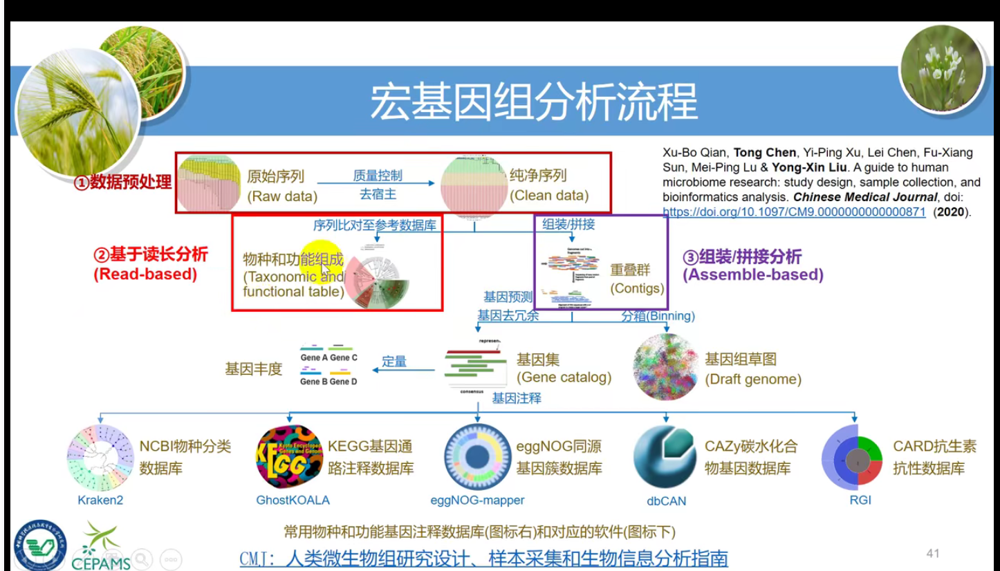
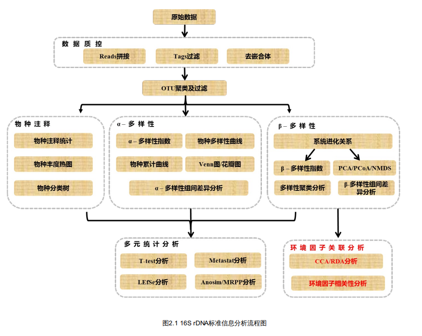
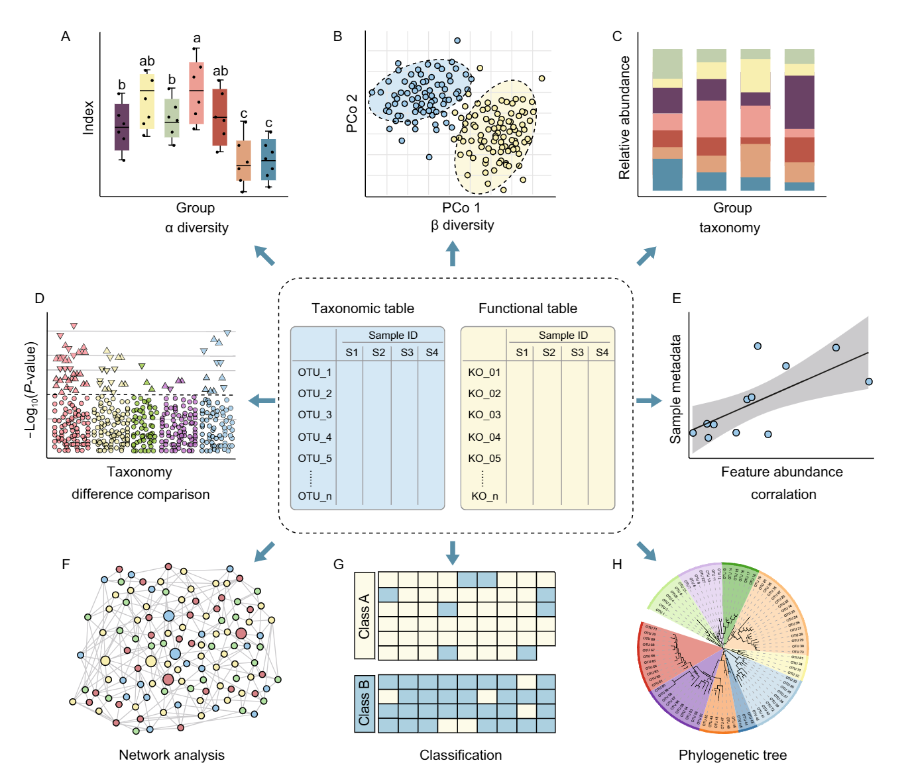

## 背景知识了解

* [易生信-扩增子教程 01-背景介绍 (qq.com)](https://mp.weixin.qq.com/s/NNc4t0htSwE2IQPxWCHbwA)
* [淘宝-不会画图请找我的个人空间_哔哩哔哩_bilibili](https://space.bilibili.com/18875177/channel/seriesdetail?sid=1291001)：这个博主是视频有空可以看看
* [宏基因组 - 推荐的 文章 - 组学大讲堂问答社区 (omicsclass.com)](https://www.omicsclass.com/articles/metagenome/recommended)：
* [2020-扩增子和宏基因组数据分析流程和可视化_哔哩哔哩_bilibili](https://www.bilibili.com/video/BV1mV411y7gt)：很全，从编程、扩增子和宏基因组流程主要软件数据库到图表美化
  * 

## 关于 ASV

首先它比用 97% 相似程度聚类的“OTU”更加 **精准** ，在后续的 alpha diversity 及物种注释中会更加准确，因为传统意义上的 OTU 的 97% 的相似程度是在 genus 水平上大家认可的，但如果需要到 species 甚至 strain 水平的话，使用传统的 OTU 是很不靠谱的。

另外，ASV 相比于 OTU 最大的好处就是可以**随时合并**不同的数据跑出来的**代表序列** ，因为使用的是 100% 的 identidy，所以一样的序列就是一样的物种，不会受到不同数据、测序平台、文库建立、处理方法等等的误差影响。所以在 qiime2 中，它甚至不使用 OTU 或者 ASV 来命名，而是直接以一个基于字符串计算的**哈希码**来进行命名序列，这样子，只要是 qiime2 上跑出来的数据，即使是不同时间不同人的结果，也可以直接合并，甚至不需要接触到原始的测序数据，也大大方便了大数据之间的整合。

所以现在也越来越多的人倡导使用 ASV 以避免数据不可合并和难以合并的缺点。

当然了 ASV 不是只有好处，除了算法上的差异以外，该有的 batch effect 它也会遇到，不过那就是另外一个话题了。这里不加讨论。

## pipeline

大概的流程

产生的图

适用于 Linux 服务器，运行大量数据，流程比较规范（推荐）

### vsearch+usearch pipeline

适用于个人笔记本运行小数据（不推荐）

* [yuan-zheng-rong/16S-rRNA-analysis-pipeline: 16S rRNA analysis pipeline (github.com)](https://github.com/yuan-zheng-rong/16S-rRNA-analysis-pipeline)
* [Example marker-gene workflow (astrobiomike.github.io)](https://astrobiomike.github.io/amplicon/workflow_ex#the-data)
* [扩增子分析——usearch+vsearch+qiime1 - 简书 (jianshu.com)](https://www.jianshu.com/p/e43ad39aff17#%E6%89%A9%E5%A2%9E%E5%AD%90%E5%88%86%E6%9E%90%E2%80%94%E2%80%94usearch+vsearch+qiime1)
* [Windows 下 16S rRNA 基因扩增子测序数据分析的简易流程 (alljournals.cn)](http://swxxx.alljournals.cn/html/2018/4/20180405.html#close)：很水的论文，作者是本科生，这样的话我也能发一篇文章
* [Windows 下 16S rRNA 基因扩增子测序数据分析的简易流程 (alljournals.cn)](http://swxxx.alljournals.cn/html/2018/4/20180405.html)

大体流程

qimme2  pipeline

* [微科盟扩增子_样本_结题报告 (bioincloud.tech)](https://bioincloud.tech/cloudir/reports/amplicon/vegetation/index.html)
* [QIIME 2 中文文档(QIIME 2 Chinese Manual) (github.com)](https://github.com/YongxinLiu/QIIME2ChineseManual)
* [MicrobiomeProtocol/QIIME2_Pipeline.sh at master · YongxinLiu/MicrobiomeProtocol (github.com)](https://github.com/YongxinLiu/MicrobiomeProtocol/blob/master/e2.QIIME2/QIIME2_Pipeline.sh) ✔ 正好也是 2021.2 版本的
* [微生物组 16S rRNA 数据分析小结: qiime2-2019.1 - 简书 (jianshu.com)](https://www.jianshu.com/p/78b5f27d97e2) ✔
* [扩增子分析流程 (qq.com)](https://mp.weixin.qq.com/s/V156q-jLhfJtFdDd_NQWjQ) ✔
* [(17 条消息) QIIME 2 16S 扩增子分析基础流程及常用命令（新手友好向）_砂之家-CSDN 博客_qiime](https://blog.csdn.net/weixin_42126262/article/details/107285753) ✔（挺好的，但是只到物种注释、α、β 多样性
* [微生物组 16S rRNA 数据分析小结：从 OTU table 到 marker 物种 - 简书 (jianshu.com)](https://www.jianshu.com/p/920a5ce3a7a0) 这篇文章算是概括了 α 多样性、β 多样性，biomarker，功能分析，但是没有纤细代码
* [2020.07.11 宏基因组-16s 扩增子分析流程 - BioLinkX 生物信息学协会](https://biolinkx.cn/2020-07-11-%E5%AE%8F%E5%9F%BA%E5%9B%A0%E7%BB%84-16s-%E6%89%A9%E5%A2%9E%E5%AD%90%E5%88%86%E6%9E%90%E6%B5%81%E7%A8%8B/): 这篇把主要的流程和为什么怎么做概括的特别特别好，可以参考，但没有代码
* [微生物组 16S rRNA 数据分析小结：raw data sequence 及其注意事项 - 简书 (jianshu.com)](https://www.jianshu.com/p/4e259bd20bba)
* [微生物扩增子测序图表解读(实例数据)-健康界 (cn-healthcare.com)](https://www.cn-healthcare.com/articlewm/20200320/content-1097140.html)：覆盖面很多
* [Amplicon sequencing analysis pipeline through qiime2 platform ](https://zouhua.top/archives/e06e2ff3.html#more)
* [QIIME 2 16S 扩增子分析基础流程及常用命令（新手友好向）_砂之家-CSDN 博客_qiime](https://blog.csdn.net/weixin_42126262/article/details/107285753)

Author：佳名

[Qiime2(二)-将 16S 数据导入 QIIME 2 - 简书 (jianshu.com)](https://www.jianshu.com/p/0aaca7f57081#1.1%20%E5%8E%9F%E5%A7%8B%E6%95%B0%E6%8D%AE%E6%A0%B7%E5%93%81%E8%B7%AF%E5%BE%84%E6%B8%85%E5%8D%95%EF%BC%88file%20path%EF%BC%89%E6%96%87%E4%BB%B6%E7%9A%84%E5%87%86%E5%A4%87)

[Qiime2 (三)-DADA2 降噪（Denoise）流程 - 简书 (jianshu.com)](https://www.jianshu.com/p/eb89d2b3a0a7)

[Qiime2(四) -过滤 feature table - 简书 (jianshu.com)](https://www.jianshu.com/p/e9db848841f2)

[Qiime2(五)-构建进化树用于多样性分析 - 简书 (jianshu.com)](https://www.jianshu.com/p/767326a713eb)

[Qiime2 (六)-Alpha 和 beta 多样性分析 - 简书 (jianshu.com)](https://www.jianshu.com/p/019fb35088fa)

[Qiime2 (七)-物种组成分析 - 简书 (jianshu.com)](https://www.jianshu.com/p/2aa33207305f)

[扩增子测序简化版（Linux 部分） - 简书 (jianshu.com)](https://www.jianshu.com/p/b69f787adcd6)

[phyloseq | 用 R 分析微生物组数据及可视化 - 云生物 (yunbios.net)](http://m.yunbios.net/phyloseq.html)

Author R 语言数据分析指南

> 这个流程中有一个问题，没有过滤就直接拆开重命名了，然后又打包为 qza 格式，其实是没有必要的
>

* [一文完不成 qiime2 微生物多样性分析(2021 版上) - 简书 (jianshu.com)](https://www.jianshu.com/p/725ee7a106b2)
* [微生物多样性 qiime2 分析流程(2）使用 qiime2 和 dada2 处理 16S 序列 - 简书 (jianshu.com)](https://www.jianshu.com/p/9451bab60e47)
  * [微生物多样性 qiime2 分析流程(3) 使用 figaro 来得到 dada2 正反向截断参数 - 简书 (jianshu.com)](https://www.jianshu.com/p/66ebd1d4558a)
* [微生物多样性 qiime2 分析流程(4) 训练特征分类器进行 16s 数据注释 - 简书 (jianshu.com)](https://www.jianshu.com/p/521149ea49df)
* [微生物多样性 qiime2 分析流程(5) 整合 dada2 分析结果 - 简书 (jianshu.com)](https://www.jianshu.com/p/8dded10e7e4a)
* [微生物多样性 qiime2 分析流程(6) 数据可视化分析(上） - 简书 (jianshu.com)](https://www.jianshu.com/p/d38b2f5aec43)
* [微生物多样性 qiime2 分析流程(7) 运用 blast 比对方法对 16s 数据进行注释 - 简书 (jianshu.com)](https://www.jianshu.com/p/85e7930f710d)
* [微生物多样性 qiime2 分析流程(8) phyloseq 整合已有 OTU 数据进行分析 - 简书 (jianshu.com)](https://www.jianshu.com/p/cd0336426f7c)
* [微生物多样性 qiime2 分析流程(9) 数据可视化分析(中）之绘制相关性热图 - 简书 (jianshu.com)](https://www.jianshu.com/p/e1dde3571d16)
* [微生物多样性 qiime2 分析流程(10) 数据可视化分析(中) 之绘制物种组成图 - 简书 (jianshu.com)](https://www.jianshu.com/p/f99f59325e68)
* [微生物多样性 qiime2 分析流程(11) 数据可视化分析(中) 之 PCA,PCOA,NMDS 分析 - 简书 (jianshu.com)](https://www.jianshu.com/p/b569992c1405)
* [微生物多样性 qiime2 分析流程(12) 数据可视化分析(中) 之 RDA,CCA 分析 - 简书 (jianshu.com)](https://www.jianshu.com/p/a7d5e645cb71)
* [微生物多样性 qiime2 分析流程(13) 数据可视化分析(中) 之 绘制 pro 版 PCOA 分析图 - 简书 (jianshu.com)](https://www.jianshu.com/p/98a18b6b97d6)

### 云端平台

[微科盟生科云, 微科盟官方 x 网站, 免费的生信分析工具 (bioincloud.tech)](https://bioincloud.tech/)

把 qiime2 得到的数据导入到这个平台就能得到结果啦，很方便

## 其他资料

* [ggplot2 给并排条形图自定义添加 P 值 - 简书 (jianshu.com)](https://www.jianshu.com/p/aaf68f2b9434)
* [一行代码绘制物种组成图 - 简书 (jianshu.com)](https://www.jianshu.com/p/08e06738321d)
* [ggtree 绘制基础版进化树 - 简书 (jianshu.com)](https://www.jianshu.com/p/f730cf7effc4)
* [ggtree 绘制进化树 - 简书 (jianshu.com)](https://www.jianshu.com/p/f572aa0e6fde)
* [R packages：phyloseq 提取特定属 Genus 的 tax - 简书 (jianshu.com)](https://www.jianshu.com/p/6f2ee0c428a0)
* [听说你想从 github 安装 R 包 - 简书 (jianshu.com)](https://www.jianshu.com/p/1225dcb8bddb)
* [根据 OTU 表绘制韦恩图 - 简书 (jianshu.com)](https://www.jianshu.com/p/11e00258a88c)
* [ggplot2 绘制弦图版物种组成图 - 简书 (jianshu.com)](https://www.jianshu.com/p/a19656948f47)
* [ggplot2 优雅的绘制高端热图 - 简书 (jianshu.com)](https://www.jianshu.com/p/f906de5152ac)
* [R packages：phyloseq（一） 16s 扩增子 α 多样性分析 - 简书 (jianshu.com)](https://www.jianshu.com/p/1c52548acbb5#4.2%20MicrobiotaProcess%E5%8C%85%E7%9A%84get_alphaindex%E5%87%BD%E6%95%B0)
* [R packages：phyloseq（二） 16s 扩增子抽平或重采样 - 简书 (jianshu.com)](https://www.jianshu.com/p/fe4c1e2d62c9)
* [R packages：phyloseq（三） 16s 扩增子 β 多样性分析 - 简书 (jianshu.com)](https://www.jianshu.com/p/afac90b67121)
* [R packages：phyloseq 提取某一 ASV 或 OTU - 简书 (jianshu.com)](https://www.jianshu.com/p/f1622c8bb8e4)
* [R packages：phyloseq 修改分组顺序 - 简书 (jianshu.com)](https://www.jianshu.com/p/dc49cb238667)
* [R packages：phyloseq 提取特定属 Genus 的 tax - 简书 (jianshu.com)](https://www.jianshu.com/p/6f2ee0c428a0) 这个可以画画？✔
